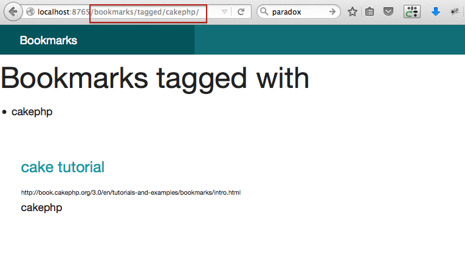

# Intro

The goal of this repository is to provide a quick overview of CakePHP 3 features.


# Steps

```php

git clone git@github.com:indera/demo_cake3.git
cd demo_cake3
make composer
make app_init
make db_upgrade
db_bake
app_start
```

# Adding a new feature (tagged bookmarks search)

You will have to edit four files (corresponding to RouteModelViewController)
in order add a a new "route" to your app:

- R: config/routes.php --> connect `/tagged/` to `tags()`
- C: src/Controller/BookmarksController.php --> connect `tags()` to `findTagged()`
- M: src/Model/Table/BookmarksTable.php --> implement `findTagged()`
- V: src/Template/Bookmarks/tags.ctp --> implement `view` for `findTagged()`

@see patches.php

# Test the new feature

Go to [http://localhost:8765/bookmarks/tagged/cakephp/](http://localhost:8765/bookmarks/tagged/cakephp/)

[]()
